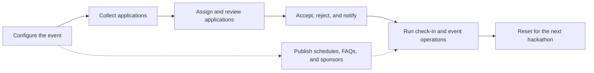
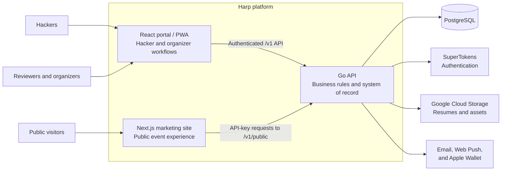

  
  <h1>Harp</h1>
  <h3>Hacker Applications &amp; Review Platform</h3>
  
<strong>A reusable foundation for running a hackathon</strong>

> Harp is under active development.

## What is Harp?

Running a hackathon often means piecing together forms, spreadsheets, email tools, schedules, and check-in systems. Harp brings that work into one place. It helps organizers manage the event from the moment applications open through the final day of the hackathon.

The Go backend sits at the center of Harp. It handles the work behind applications, reviews, acceptances and rejections, schedules, walk-in queues, user access, event settings, and live event data. Two web experiences are built around it:

- A **React portal** gives hackers, reviewers, organizers, and super admins the tools they need.
- A **Next.js marketing site** introduces the event to the public and pulls changing schedules, FAQs, and sponsor information from the backend.

The marketing site is deliberately separate from the portal. Every iteration of a hackathon should redesign it to match that year's theme and identity. The underlying event data and organizer workflows can stay in Harp, so a fresh public experience does not mean rebuilding the whole platform.

## Application walkthrough

<!--
Add the product walkthrough GIF to docs/harp-demo.gif, then replace the line
below with:

  

-->

_Demo GIF coming soon._

## One platform for the full event lifecycle

Harp is useful for more than registration. Organizers can set up a new event, work through admissions, run the hackathon in real time, and prepare the platform for the next year.

## What the platform offers

### Hacker experience

- Account creation and secure sign-in
- Configurable, multi-step applications with resume uploads
- Application submission and status tracking
- A personalized event dashboard, schedule, FAQ, and hacker pack
- A personal QR code for fast check-in and activity scans
- Notification feed and opt-in web push notifications
- Points and participation tracking
- Optional Apple Wallet event pass
- Installable portal experience through PWA support

### Applications and admissions

- Custom application sections, fields, and validation
- Searchable applicant records and application statistics
- Reviewer assignment and configurable reviews per application
- Structured voting, reviewer notes, and completed-review history
- Acceptance, rejection, and waitlist status management
- Bulk decision-email delivery and delivery progress
- Walk-in queue management and promotion into the event

### Day-of event operations

- Schedule creation and live updates
- QR scanning for check-in, meals, workshops, and custom activities
- Scan statistics and configurable scan types
- Meal-group configuration and attendance visibility
- Scheduled announcements generated manually or from schedule items
- Hacker-facing schedules, notifications, FAQs, and event resources

### Content and public presence

- Sponsor management, including logos, tiers, and links
- Frequently asked question management
- A public schedule managed from the organizer portal
- API-backed content for the marketing site, keeping fast-changing information in one place
- A marketing site that can and should be redesigned for every iteration of the hackathon

### Administration and reuse

- Hacker, admin, and super-admin roles with protected workflows
- User search and role management
- Configurable event dates, name, contact details, application deadline, and feature availability
- Granular organizer permissions for schedules, sponsors, and FAQs
- Annual reset workflow that preserves reusable configuration while clearing event-specific activity

## High-level architecture

The Go backend is the shared source of truth. The portal uses authenticated, role-aware endpoints for hacker and organizer work. The marketing site uses a smaller public-content API for schedules, FAQs, and sponsor data. Organizers can update that information once, and every site that consumes the API can show the latest version.

## The three core services

| Service                    | Location              | Responsibility                                                                                                           |
| -------------------------- | --------------------- | ------------------------------------------------------------------------------------------------------------------------ |
| **Go backend**             | `cmd/api`, `internal` | Owns business logic, authorization, applications, reviews, decisions, event operations, public content, and persistence. |
| **React portal**           | `client/portal`       | Provides the authenticated hacker, admin, and super-admin experience as a Vite-powered PWA.                              |
| **Next.js marketing site** | `client/marketing`    | Provides the public event website and renders frequently updated content from the Go public API.                         |

## Technology at a glance

- **Backend:** Go, Chi, PostgreSQL
- **Portal:** React, TypeScript, Vite, Tailwind CSS, shadcn/ui
- **Marketing:** Next.js, React, TypeScript, Tailwind CSS
- **Platform services:** SuperTokens, Google Cloud Storage, email delivery, Web Push, Apple Wallet
- **Delivery:** Docker-based local and production workflows

## Design principle

Hackathon software should make the event easier to run. Harp keeps event content, settings, applicants, schedules, and live operations in one backend. The participant portal can stay familiar from year to year, while the marketing site should be redesigned for each new iteration of the hackathon. That gives every event its own personality without forcing the team to rebuild the systems behind it.
